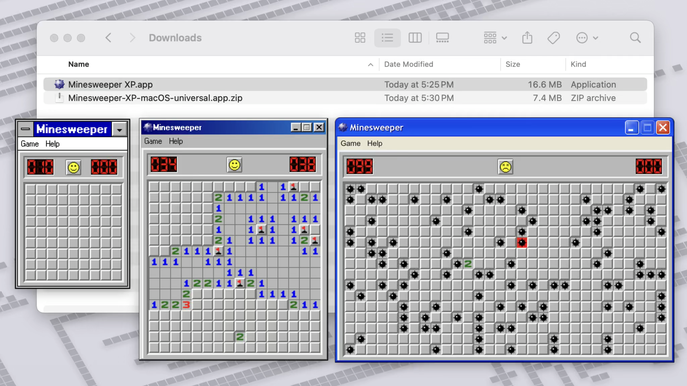

# Minesweeper XP

Experience the classic Minesweeper XP (+ 98 and 3.1) on macOS, Windows, and Linux!

*Fun Fact*: After Windows 98, the tiles in Beginner mode increased from 8x8 to 9x9.

## Demo

## Installation

|            | macOS         | Windows       | Linux            |
|------------|---------------|---------------|------------------|
| Standalone | [Download .zip](https://github.com/AkshayKalose/Minesweeper-XP/releases/latest/download/Minesweeper-XP-macOS-universal.app.zip) | [Download .zip](https://github.com/AkshayKalose/Minesweeper-XP/releases/latest/download/Minesweeper-XP-windows-amd64.zip) | [Download .tar.gz](https://github.com/AkshayKalose/Minesweeper-XP/releases/latest/download/Minesweeper-XP-linux-amd64.tar.gz) |
| Installer  | [Download .dmg](https://github.com/AkshayKalose/Minesweeper-XP/releases/latest/download/Minesweeper-XP-macOS-universal-installer.dmg) | [Download .exe](https://github.com/AkshayKalose/Minesweeper-XP/releases/latest/download/Minesweeper-XP-windows-amd64-installer.exe) |                  |

## FAQ

### How do I perform chording?
Chording is supported for both mouse and trackpad. With a mouse, you can chord by either **clicking both the left and right buttons** or by **middle clicking the scroll wheel**. With a trackpad, you can chord by holding down at least one of these additional keyboard buttons while left clicking: **Ctrl, Alt, Shift, Meta (Cmd for macOS, Win for Windows)**.

#### What is chording?
Chording is a feature in Minesweeper which allows you to open up all adjacent unopened tiles relative to an open tile with the number *n*, only if there are also at least *n* adjacent flags. (Basically, with chording, you can flag the unsafe tiles with bombs, and open all the adjacent safe tiles in one click.)

## Links

### Built on top of

- https://github.com/ShizukuIchi/minesweeper
- https://github.com/botoxparty/XP.css
- https://github.com/nielssp/classic-stylesheets

### Other related projects

#### Web OS
- https://github.com/1j01/98
- https://github.com/ShizukuIchi/winXP
- https://github.com/lrusso/VirtualXP

#### Libraries
- https://github.com/1j01/os-gui
- https://github.com/jdan/98.css
- https://github.com/khang-nd/7.css

#### Web Applications
- https://github.com/1j01/jspaint
- https://github.com/ziebelje/minesweeper
- https://github.com/AlexAegis/minesweeper

### My other apps
- [789-Zip](https://789-zip.app) - A native macOS app for the 7-Zip archiving utility.
