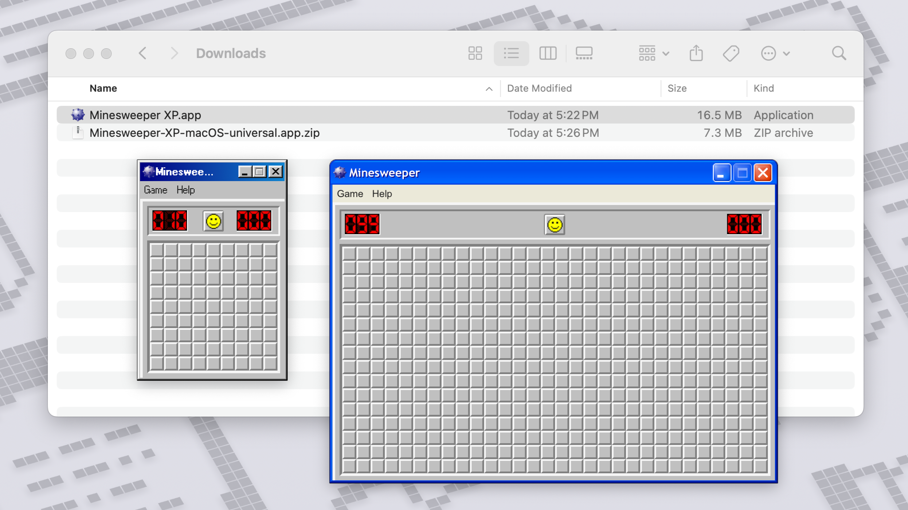

# Minesweeper XP


Experience the classic Minesweeper XP (+ 98) on macOS, Windows, and Linux!

*Fun Fact*: After Windows 98, the tiles in Beginner mode increased from 8x8 to 9x9.

## Demo


## Installation

|            | macOS         | Windows       | Linux            |
|------------|---------------|---------------|------------------|
| Standalone | [Download .zip](https://github.com/AkshayKalose/Minesweeper-XP/releases/latest/download/Minesweeper-XP-macOS-universal.app.zip) | [Download .zip](https://github.com/AkshayKalose/Minesweeper-XP/releases/latest/download/Minesweeper-XP-windows-amd64.zip) | [Download .tar.gz](https://github.com/AkshayKalose/Minesweeper-XP/releases/latest/download/Minesweeper-XP-linux-amd64.tar.gz) |
| Installer  | [Download .pkg](https://github.com/AkshayKalose/Minesweeper-XP/releases/latest/download/Minesweeper-XP-macOS-universal-installer.pkg) | [Download .exe](https://github.com/AkshayKalose/Minesweeper-XP/releases/latest/download/Minesweeper-XP-windows-amd64-installer.exe) |                  |

### macOS
For macOS, the app is currently not signed nor notarized. In order to open the application and avoid the `"Minesweeper XP.app" Not Opened` popup, you will need to open the Terminal application and run one of the following commands on the file you downloaded:

```
xattr -d com.apple.quarantine ~/Downloads/Minesweeper-XP-macOS-universal.app.zip
xattr -d com.apple.quarantine ~/Downloads/Minesweeper-XP-macOS-universal-installer.pkg
xattr -d com.apple.quarantine ~/Downloads/Minesweeper\ XP.app
xattr -d com.apple.quarantine /Applications/Minesweeper\ XP.app
```

Select the appropriate command to run based on the file you downloaded and/or extracted. You will only ever need to run one of these commands at most once, after downloading. The command will remove the `com.apple.quarantine` attribute from the downloaded file.

## Links

### Built on top of

- https://github.com/ShizukuIchi/minesweeper
- https://github.com/botoxparty/XP.css

### Other related projects

#### Web OS
- https://github.com/1j01/98
- https://github.com/ShizukuIchi/winXP
- https://github.com/lrusso/VirtualXP

#### Libraries
- https://github.com/1j01/os-gui
- https://github.com/jdan/98.css

#### Web Applications
- https://github.com/1j01/jspaint
- https://github.com/ziebelje/minesweeper
- https://github.com/AlexAegis/minesweeper
